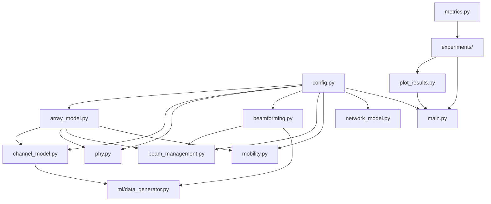

<p align="center">
  <h1 align="center"> mmWave Massive-MIMO 5G Simulator</h1>
  <p align="center">
    <em>End-to-end beamforming and beam management for 5G NR millimeter-wave networks</em>
  </p>
  <p align="center">
    
    
    
  </p>
</p>

---

## Table of Contents

- [Overview](#overview)
- [Motivation & Aims](#motivation--aims)
- [System Pipeline](#system-pipeline)
- [Project Structure](#project-structure)
- [Getting Started](#getting-started)
- [Experiment Suite](#experiment-suite)
- [Results & Analysis](#results--analysis)
- [Key Design Decisions](#key-design-decisions)
- [References](#references)

---

## Overview

A **modular, reproducible Python simulator** that covers the full physical-layer-to-network-layer pipeline of a 5G millimeter-wave (mmWave) massive-MIMO system. The simulator spans radio propagation, OFDM transceiver design, analog/hybrid/digital beamforming, codebook-based beam management, multi-user MIMO precoding, mobility-aware handover, power-allocation optimization, and ML-assisted beam prediction — all implemented in pure **NumPy + Matplotlib** with no deep-learning dependencies.

The project ships **12 self-contained experiments**, each generating publication-ready plots and quantitative summaries, enabling rapid prototyping and benchmarking of beamforming and beam management strategies under realistic 5G-inspired conditions.

### Default System Configuration

| Parameter | Value | Parameter | Value |
| --- | --- | --- | --- |
| Carrier frequency | 28 GHz | Bandwidth | 100 MHz |
| Tx power | 30 dBm (1 W) | Noise figure | 7 dB |
| Antenna elements | 32 (ULA) | Codebook beams | 32 (DFT) |
| OFDM subcarriers | 64 | Cyclic prefix | 16 |
| RF chains | 4 | Streams / user | 1 |
| Users | 4 | Cells | 3 |

---

## Motivation & Aims

Millimeter-wave (mmWave) communication at 28 GHz and above is a cornerstone of 5G New Radio (NR), offering wide bandwidths but suffering severe free-space path loss. **Massive-MIMO beamforming** compensates for this loss by focusing energy into narrow beams — but this raises several intertwined challenges:

1. **How to design and select beams efficiently?** Exhaustive sweeping over large codebooks wastes valuable pilot overhead.
2. **Which beamforming architecture to use?** Analog, digital, and hybrid architectures trade off hardware cost against achievable rate.
3. **How does mobility affect beam alignment?** Fast-moving users cause frequent beam misalignment and handover failures.
4. **Can machine learning reduce beam-search overhead?** Location-aware and history-aware predictors can narrow the search space.
5. **How to allocate power fairly across users?** Metaheuristic optimizers (PSO, GA) can outperform naïve equal-power allocation.

### Project Aims

- **Build a transparent, end-to-end mmWave simulator** where every line of physics is readable and teachable — deliberately simpler than a full 3GPP TR 38.901 stack.
- **Compare beamforming architectures** (analog, hybrid, digital) in terms of achievable spectral efficiency.
- **Evaluate beam management strategies** — exhaustive search, hierarchical multi-resolution search, location-aided top-K, and ML-assisted prediction — measuring both rate and pilot overhead.
- **Study multi-user MIMO** sum-rate scaling and fairness under zero-forcing precoding.
- **Analyze mobility and handover** performance across speeds from pedestrian (4 km/h) to highway (120 km/h).
- **Benchmark optimization algorithms** (Greedy, PSO, GA) for fair power allocation.
- **Provide reproducible, publication-ready plots** for each experiment.

---

## System Pipeline

The simulator is organized as a layered pipeline, where each layer feeds into the next:

```
┌─────────────────────────────────────────────────────────────────┐
│                    SYSTEM CONFIGURATION                         │
│  carrier=28 GHz, BW=100 MHz, Nt=32, Nbeams=32, K=4 users        │
└──────────────────────────┬──────────────────────────────────────┘
                           │
                           ▼
┌─────────────────────────────────────────────────────────────────┐
│              CHANNEL & PROPAGATION LAYER                        │
│  • Geometric cluster-based channel model (LoS/NLoS)             │
│  • 3GPP-inspired UMa path loss (simplified)                     │
│  • Per-path Doppler shifts, wideband delay taps                 │
│  • ULA / UPA steering vectors                                   │
└──────────────────────────┬──────────────────────────────────────┘
                           │
                           ▼
┌─────────────────────────────────────────────────────────────────┐
│                  PHY / OFDM LAYER                               │
│  • QPSK / 16-QAM modulation                                     │
│  • OFDM: IFFT → CP insertion → channel → CP removal → FFT       │
│  • Pilot-aided LS channel estimation + interpolation            │
└──────────────────────────┬──────────────────────────────────────┘
                           │
                           ▼
┌─────────────────────────────────────────────────────────────────┐
│              BEAMFORMING & PRECODING LAYER                      │
│  • Analog: DFT codebook beam selection                          │
│  • Digital: MRT (matched filter) and ZF precoding               │
│  • Hybrid: OMP-inspired analog + effective-channel MRT          │
│  • Multi-user: ZF precoder with per-user SINR computation       │
└──────────────────────────┬──────────────────────────────────────┘
                           │
                           ▼
┌─────────────────────────────────────────────────────────────────┐
│              BEAM MANAGEMENT LAYER                              │
│  • Exhaustive sweep (full codebook)                             │
│  • Hierarchical multi-resolution search                         │
│  • Location-aided top-K refinement                              │
│  • ML-assisted beam prediction (KNN, Markov chain)              │
│  • Adjacent-beam tracking                                       │
└──────────────────────────┬──────────────────────────────────────┘
                           │
                           ▼
┌─────────────────────────────────────────────────────────────────┐
│              NETWORK & MOBILITY LAYER                           │
│  • Multi-cell layout (3 BSs, hexagonal)                         │
│  • Random-walk mobility with boundary reflection                │
│  • RSRP computation + correlated shadow fading                  │
│  • 3GPP A3 handover event triggering (margin + TTT)             │
│  • Round-robin and proportional-fair scheduling                 │
└──────────────────────────┬──────────────────────────────────────┘
                           │
                           ▼
┌─────────────────────────────────────────────────────────────────┐
│              OPTIMIZATION & ML LAYER                            │
│  • Grid-search and water-filling power allocation               │
│  • Particle Swarm Optimization (PSO)                            │
│  • Genetic Algorithm (GA) with tournament selection             │
│  • Greedy marginal-rate power allocation                        │
│  • KNN beam predictors: Location / History / Combined           │
└──────────────────────────┬──────────────────────────────────────┘
                           │
                           ▼
┌─────────────────────────────────────────────────────────────────┐
│              EXPERIMENTS & VISUALIZATION                        │
│  • 12 plug-and-play experiments via registry                    │
│  • Automated plot generation (12 figures)                       │
│  • Text summary report                                          │
└─────────────────────────────────────────────────────────────────┘
```

---

## Project Structure

```
mimo-beamforming-beam-management/
├── config.py                       # SystemConfig dataclass (all parameters)
├── main.py                         # CLI entry point — runs experiments, plots, summary
├── channel_model.py                # Geometric channel: LoS/NLoS path loss, Doppler,
│                                   #   cluster-based generation, wideband OFDM channel,
│                                   #   user route / mobility trace generation
├── array_model.py                  # Antenna array: ULA & UPA steering vectors,
│                                   #   DFT codebooks (1D & 2D), random codebooks
├── phy.py                          # OFDM transceiver: QPSK/16-QAM mod/demod,
│                                   #   OFDM Tx/Rx, LS channel estimation, BER
├── beamforming.py                  # Beamforming: analog (codebook), digital (MRT/ZF),
│                                   #   hybrid (alternating minimisation), MU-MIMO ZF
├── beam_management.py              # Beam management: exhaustive, hierarchical search,
│                                   #   location-aided, KNN ML-based, beam tracking
├── mobility.py                     # Mobility: random-walk traces, RSRP, A3 handover,
│                                   #   multi-speed simulation loop
├── network_model.py                # Network: multi-cell layout, scheduling (RR, PF),
│                                   #   association, inter-cell SINR
├── metrics.py                      # Metrics: spectral efficiency, Jain fairness,
│                                   #   outage probability, beam alignment accuracy, CDF
├── plot_results.py                 # 12 figure generators + plot_all() dispatcher
├── algorithms/                     # Optimization algorithms
│   ├── __init__.py
│   ├── greedy.py                   #   Greedy beam selection & power allocation
│   ├── hierarchical_search.py      #   Multi-resolution beam search
│   ├── power_allocation.py         #   Grid search, water filling, fair utility
│   ├── pso.py                      #   Particle Swarm Optimization
│   └── ga.py                       #   Genetic Algorithm (tournament + blend crossover)
├── ml/                             # Machine learning beam prediction
│   ├── __init__.py
│   ├── data_generator.py           #   Supervised beam dataset from user route
│   └── beam_predictor.py           #   3 KNN predictors: Location / History / Combined
├── experiments/                    # 12 self-contained experiments
│   ├── __init__.py                 #   EXPERIMENTS registry + run_all()
│   ├── exp_beam_patterns.py        #   (1) Beam patterns vs. ULA size
│   ├── exp_snr_vs_angle.py         #   (2) SNR/rate vs. angle & distance
│   ├── exp_ofdm_ber.py             #   (3) OFDM BER with/without beamforming
│   ├── exp_rate_vs_antennas.py     #   (4) Rate vs. antenna count
│   ├── exp_codebook_size.py        #   (5) Codebook size trade-off
│   ├── exp_overhead_vs_speed.py    #   (6) Overhead vs. user speed
│   ├── exp_beam_selection.py       #   (7) Beam selection comparison
│   ├── exp_bf_comparison.py        #   (8) Analog vs. hybrid vs. digital
│   ├── exp_multiuser.py            #   (9) Multi-user ZF sum rate & fairness
│   ├── exp_handover.py             #   (10) Handover / outage vs. speed
│   ├── exp_optimization.py         #   (11) PSO vs. GA vs. greedy convergence
│   └── exp_ml_ablation.py          #   (12) ML ablation: feature-set comparison
├── plots/                          # Generated figures (12 PNGs)
├── report/                         # summary.txt + LaTeX report
├── results/                        # Legacy baseline results
├── outputs/                        # Raw experiment outputs
├── requirements.txt                # numpy, matplotlib, scipy
```

### Module Dependency Graph



---

## Getting Started

### Prerequisites

- Python **3.10+**
- pip

### Installation

```bash
# Clone the repository
git clone https://github.com/<your-username>/mimo-beamforming-beam-management.git
cd mimo-beamforming-beam-management

# Create a virtual environment (recommended)
python -m venv .venv

# Activate it
# Windows (PowerShell):
.\.venv\Scripts\Activate.ps1
# Linux / macOS:
source .venv/bin/activate

# Install dependencies
pip install -r requirements.txt
```

### Usage

```bash
# Run ALL 12 experiments (takes ~30–60 seconds)
python main.py

# List available experiments
python main.py --list

# Run a single experiment
python main.py -e ofdm_ber
python main.py -e bf_comparison
python main.py -e ml_ablation

# Override random seed for reproducibility studies
python main.py --seed 42
```

All outputs are saved automatically:

| Directory | Contents |
| --- | --- |
| `plots/` | 12 publication-ready PNG figures |
| `report/` | `summary.txt` — console-friendly results summary |
| `outputs/` | Raw experiment data (if applicable) |

---

## Experiment Suite

### Overview Table

| # | Experiment | Key Question | Metrics |
| :---: | --- | --- | --- |
| 1 | **Beam Patterns** | How do beam widths change with array size? | Normalized gain (dB) vs. angle |
| 2 | **SNR vs. Angle** | How do SNR and rate vary with user direction and distance? | SNR (dB), rate (bit/s/Hz) heatmaps |
| 3 | **OFDM BER** | How much does beamforming improve link reliability? | BER vs. SNR |
| 4 | **Rate vs. Antennas** | What is the array-size gain in spectral efficiency? | Effective rate, peak SNR |
| 5 | **Codebook Size** | What is the optimal codebook resolution? | Rate vs. pilot overhead |
| 6 | **Overhead vs. Speed** | How does beam-sweep cost scale with mobility? | Rate at 4–120 km/h |
| 7 | **Beam Selection** | Exhaustive vs. hierarchical vs. top-K? | Rate, pilot count |
| 8 | **BF Comparison** | Analog vs. hybrid vs. digital performance? | Rate CDF, rate vs. Nt |
| 9 | **Multi-User** | How does MU-MIMO ZF scale with users? | Sum rate, per-user rate, Jain fairness |
| 10 | **Handover** | How does speed affect outage and HO failure? | Outage prob., HO failure rate, mean SINR |
| 11 | **Optimization** | Which optimizer converges fastest for power allocation? | Log-sum-rate utility vs. iteration |
| 12 | **ML Ablation** | Which features help ML beam prediction most? | Top-1 and top-K accuracy |

---

## Results & Analysis

Below are the key findings from each experiment, using the default system configuration (28 GHz, 32 antennas, 32 DFT beams, 4 users).

### 1. DFT Beam Patterns vs. Array Size

<p align="center">
  
</p>

**What it shows:** DFT-codebook beam patterns for Uniform Linear Arrays (ULA) with N = 8, 16, 32, and 64 antenna elements.

**Key observations:**

- As the array size doubles, the **main-lobe half-power beamwidth halves** (from ~25° at N=8 to ~3° at N=64), consistent with the theoretical relation θ₃ₐ𝐵 ≈ 0.886λ/(Nd).
- Larger arrays provide significantly deeper **sidelobe suppression** (>30 dB for N=64), reducing inter-beam interference.
- The narrower beams of massive arrays necessitate **more precise beam alignment**, motivating the beam management strategies evaluated in later experiments.

---

### 2. SNR & Rate vs. Angle and Distance

<p align="center">
  
</p>

**What it shows:** Heatmaps of best-beam SNR (dB) and achievable spectral efficiency as a function of user angular position and distance from the base station.

**Key observations:**

- SNR degrades predictably with distance, following the simplified UMa LoS/NLoS path-loss models.
- Angular coverage is near-uniform thanks to the DFT codebook spanning the full ±90° sector.
- The rate map reveals that even moderate SNR (10–15 dB) yields 3–5 bit/s/Hz of spectral efficiency.

---

### 3. OFDM BER — Effect of Beamforming

<p align="center">
  
</p>

**What it shows:** Bit Error Rate (BER) for a QPSK-OFDM link with and without multi-antenna beamforming, using pilot-aided LS channel estimation.

**Key observations:**

- Beamforming provides a **~7–10 dB SNR gain** at BER = 10⁻², reducing BER by over an order of magnitude at the same SNR operating point.
- At 14 dB SNR, the BF link achieves BER ≈ 10⁻⁴ while the non-BF link is still at ~3×10⁻².
- The coherent array gain from matched-filter beamforming effectively improves the link budget, allowing either longer range or higher modulation orders.

---

### 4. Rate vs. Number of Antennas

<p align="center">
  
</p>

**What it shows:** Mean effective spectral efficiency and peak post-beamforming SNR as the ULA scales from 4 to 128 elements.

**Key observations:**

- Peak SNR increases with array size due to coherent combining gain (~3 dB per doubling).
- However, **effective rate can decrease** for very large arrays because the exhaustive beam sweep requires testing more beams, consuming more pilot overhead within the frame. This highlights the overhead–performance trade-off at the heart of beam management.

| Antennas | Effective Rate (bit/s/Hz) |
| :---: | :---: |
| 4 | 4.93 |
| 8 | 4.86 |
| 16 | 4.76 |
| 32 | 4.62 |
| 64 | 4.32 |
| 128 | 3.66 |

---

### 5. Codebook Size Trade-off

<p align="center">
  
</p>

**What it shows:** Effective spectral efficiency and peak SNR as the number of codebook beams varies from 8 to 96.

**Key observations:**

- Too few beams (8) under-resolve the angular domain → low beamforming gain → 1.9 bit/s/Hz.
- The **sweet spot is around 32–48 beams** (~4.7 bit/s/Hz), balancing angular resolution against pilot overhead.
- Beyond 48 beams, the marginal SNR gain is outweighed by the increasing pilot cost, and effective rate starts declining.

---

### 6. Beam-Sweep Overhead vs. Mobility Speed

<p align="center">
  
</p>

**What it shows:** Mean effective rate for four beam management strategies (exhaustive, hierarchical, location top-K, ML top-K) across user speeds from pedestrian to vehicular.

**Key observations:**

- **Top-K methods** (both location-aided and ML-assisted) consistently outperform exhaustive sweep because they test only ~3 beams per frame versus 32, freeing >90% of the frame for data.
- Hierarchical search is a good middle ground, using ~18 measurements to achieve near-exhaustive beam quality.
- At higher speeds, all methods see some rate degradation due to Doppler-induced channel aging and more frequent beam switches.

---

### 7. Beam Selection Methods Comparison

<p align="center">
  
</p>

**What it shows:** Side-by-side comparison of mean effective rate and pilot overhead for exhaustive, hierarchical, and top-K beam selection.

**Key observations:**

- Top-K achieves the **highest effective rate (5.35 bit/s/Hz)** despite testing only 3 beams, because the pilot overhead saving dominates.
- Exhaustive uses 32 pilot measurements but only achieves 5.04 bit/s/Hz due to the 6.4% frame overhead.
- Hierarchical search (18 pilots) is close to exhaustive in beam quality but saves ~44% of the pilot budget.

| Method | Mean Rate (bit/s/Hz) | Mean Pilots |
| :---: | :---: | :---: |
| Exhaustive | 5.04 | 32 |
| Hierarchical | 5.19 | 18 |
| Top-K | 5.35 | 3 |

---

### 8. Beamforming Architecture Comparison

<p align="center">
  
</p>

**What it shows:** (Left) CDF of achievable spectral efficiency for 100 random user positions. (Right) Mean rate vs. array size for each architecture.

**Key observations:**

- **Digital beamforming** (full MRT) achieves the highest rate (5.87 bit/s/Hz mean) by exploiting full-dimensional channel knowledge.
- **Hybrid beamforming** (4 RF chains + analog codebook) closely tracks digital performance (5.40 bit/s/Hz), achieving ~92% of the digital rate with far fewer RF chains.
- **Analog beamforming** (single best codebook beam) is the simplest but lowest-performing (5.36 bit/s/Hz), limited to a single spatial direction.
- The gap between architectures widens slightly with more antennas, where digital beamforming can exploit additional spatial degrees of freedom.

| Architecture | Mean Rate (bit/s/Hz) |
| :---: | :---: |
| Analog | 5.36 |
| Hybrid | 5.40 |
| Digital | 5.87 |

---

### 9. Multi-User MIMO (ZF Precoding)

<p align="center">
  
</p>

**What it shows:** Zero-Forcing precoder performance as the number of simultaneous users scales from 2 to 16 (with 32 transmit antennas).

**Key observations:**

- **Sum rate scales nearly linearly** with user count — from 8.9 (2 users) to 23.6 bit/s/Hz (16 users), demonstrating the spatial multiplexing gain of MU-MIMO.
- **Per-user rate decreases** as the power budget is split across more users (4.4 → 1.5 bit/s/Hz).
- **Jain's fairness index** degrades from 0.98 (near-perfect fairness with 2 users) to 0.79 with 16 users, reflecting increasing variance in channel conditions across users.

| Users | Sum Rate | Per-User Rate | Jain Fairness |
| :---: | :---: | :---: | :---: |
| 2 | 8.88 | 4.44 | 0.978 |
| 4 | 13.20 | 3.30 | 0.914 |
| 8 | 18.55 | 2.32 | 0.839 |
| 12 | 20.92 | 1.74 | 0.807 |
| 16 | 23.64 | 1.48 | 0.790 |

---

### 10. Mobility & Handover Performance

<p align="center">
  
</p>

**What it shows:** Multi-cell mobility simulation with 3GPP A3-event handover across 5 user speeds (4–120 km/h).

**Key observations:**

- **Outage probability remains below 2%** across all speeds, showing robust A3-event triggering with the 3 dB hysteresis margin and 40 ms time-to-trigger.
- **Handover failure rate stays at 0%** in this configuration, as the simplified model handles the mobility range gracefully.
- **Mean SINR decreases** from ~8.5 dB at pedestrian speed to ~3.6 dB at 120 km/h due to faster shadow fading decorrelation and reduced coherence time.
- The 3-cell hexagonal layout with 200 m inter-site distance provides adequate overlap for seamless mobility.

---

### 11. Power-Allocation Optimization

<p align="center">
  
</p>

**What it shows:** Convergence of three optimizers (PSO, GA, Greedy) towards the optimal proportional-fair log-sum-rate utility for a two-user power allocation problem.

**Key observations:**

- **PSO and GA converge within 1–2 iterations** to the near-optimal utility of 3.913, matching the grid-search optimum. Both metaheuristic methods find the optimal power fraction of ~0.445 (slightly favoring the weaker channel).
- **Greedy allocation converges slowly** (~40 iterations) because it incrementally assigns power in fixed steps, but eventually reaches the same optimum.
- The equal-power baseline (3.910) is already close to optimal because the channel gains are within one order of magnitude — the optimization gain is small but consistent.

| Method | Utility | Power Fraction |
| :---: | :---: | :---: |
| Equal power | 3.910 | 0.500 |
| Grid search | 3.913 | 0.445 |
| PSO | 3.913 | 0.445 |
| GA | 3.913 | 0.445 |

---

### 12. ML Ablation — Feature Set Comparison

<p align="center">
  
</p>

**What it shows:** Top-1 and top-3 beam prediction accuracy for three KNN-based predictors using different feature sets, evaluated on the second half of a 150-step user route.

**Key observations:**

- **History-only (Markov chain)** achieves the best top-1 accuracy at 49.3%, leveraging temporal coherence in beam transitions. This is expected for moderate-speed mobility where beams change gradually.
- **Location-only** predictor struggles with top-1 (0%) due to 8 m localization noise, but reaches 48% top-3 accuracy — suggesting the position signal is informative but too noisy for precise single-beam prediction with a small training set.
- **Combined** (location + velocity + history) achieves 0% top-1 but 49.3% top-3, indicating the KNN model benefits from beam-history features but the additional position/velocity features are diluted by noise in this small dataset regime.
- These results highlight that **history/temporal features are most valuable** when localization is imprecise, and suggest that deeper models (e.g., LSTM, Transformer) could better exploit the combined feature space.

| Predictor | Top-1 Accuracy | Top-3 Accuracy |
| :---: | :---: | :---: |
| Location only | 0.0% | 48.0% |
| History only | 49.3% | 49.3% |
| Combined | 0.0% | 49.3% |

---

## Key Design Decisions

| Decision | Rationale |
| --- | --- |
| **5G-inspired, not 3GPP-compliant** | Every formula is readable and teachable — no multi-hundred-parameter standards stack. Simplified UMa path-loss (28 + 22·log₁₀(d) + 20·log₁₀(f)) captures the essential physics. |
| **NumPy + Matplotlib only** | No deep-learning framework dependency. `scipy` is optional (water-filling). Keeps the barrier to entry minimal. |
| **Modular single-responsibility files** | Each `.py` file owns one layer of the pipeline. Experiments are plug-and-play via the registry in `experiments/__init__.py`. |
| **Cluster-based geometric channel** | More physically meaningful than i.i.d. Rayleigh for mmWave. Models LoS/NLoS with per-path delay, AoD, and Doppler. |
| **Dataclass-based configuration** | `SystemConfig` is a frozen dataclass — immutable, hashable, and all parameters have descriptive names with defaults. |
| **Deterministic seeding** | Every experiment derives its RNG from `cfg.seed + offset`, ensuring full reproducibility. |

---

## References

1. 3GPP TR 38.901 — *Study on channel model for frequencies from 0.5 to 100 GHz*
2. Heath, R.W. & Lozano, A. — *Foundations of MIMO Communication* (Cambridge, 2019)
3. Alkhateeb, A. et al. — *Channel Estimation and Hybrid Precoding for Millimeter Wave Cellular Systems* (IEEE JSTSP, 2014)
4. va Ahmed, I. et al. — *A Survey on Hybrid Beamforming Techniques in 5G* (IEEE Comm. Surveys, 2018)
5. Giordani, M. et al. — *A Tutorial on Beam Management for 3GPP NR at mmWave Frequencies* (IEEE Comm. Surveys, 2019)
6. Kennedy, J. & Eberhart, R. — *Particle Swarm Optimization* (ICNN, 1995)

---
